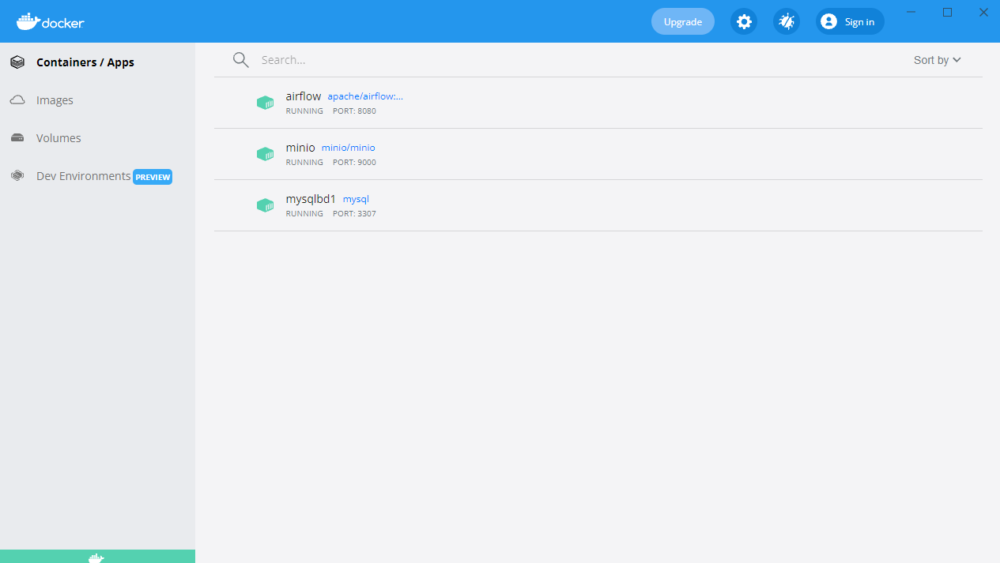
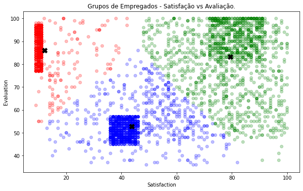
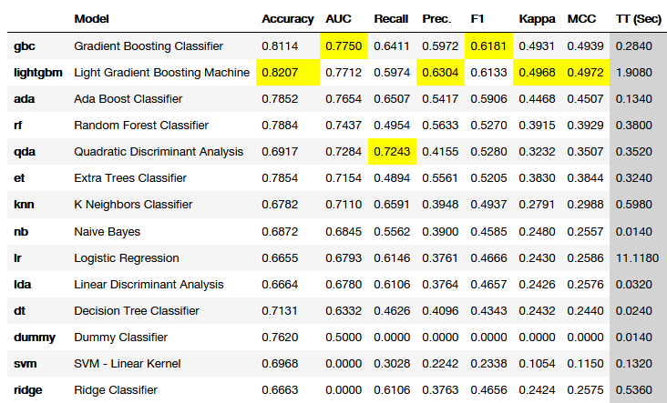
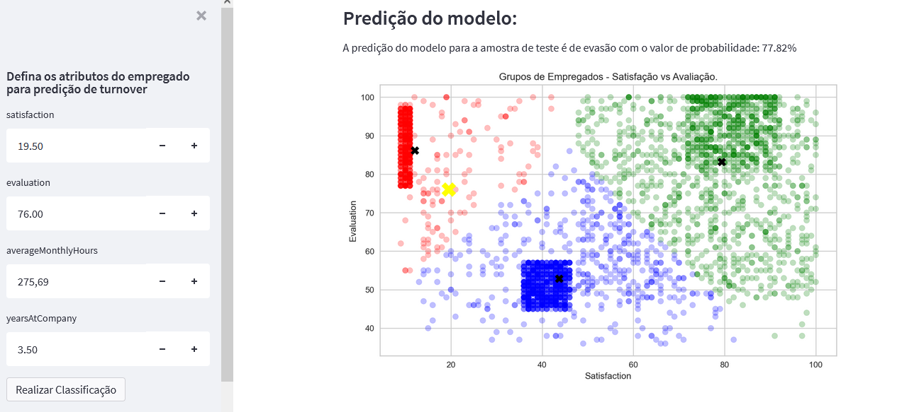

# Human Resources Analytics – Análise de Recursos Humanos

Neste projeto pude utilizar os dados fornecidos pela empresa para ajudá-la a responder questões como:

•	Quais são os fatores que influenciam um colaborador a deixar a empresa?
•	Como reter pessoas?
•	Como prever se um determinado colaborador vai deixar a empresa e qual a probabilidade de isso acontecer?

Por fim, disponibilizar os recursos para que a empresa possa fazer a predição e verificar se um colaborador vai ou não deixar a empresa com base em atributos como comportamento e carga de trabalho, nível de satisfação com a empresa e avaliação de performance.
Para esse problema, foi construída uma solução completa para armazenamento, gestão e automatização do fluxo de dados, utilizando tecnologias como Docker, Minio e Apache Airflow além de ferramentas robustas para análise de dados e machine learning como Pandas, Scikit-learn, PyCaret, SweetViz e Streamlit.
Com o Docker foi criada uma máquina virtual para rodar apenas as aplicações necessárias para o desenvolvimento da solução. Foi usado o Minio para criação do datalake, onde foi feita a ingestão dos dados brutos e armazenamento dos dados tratados e Apache Airflow para orquestrar e automatizar o processo.

Após criação e configuração de toda essa estrutura, foi possível criar e modelar atributos relevantes para a análise, utilizando diversas fontes de dados como arquivos em .xlsx, .json e dados do DBMS MySQL.

# Na etapa de análise exploratória dos dados foram descobertos insights importantes:
•	A empresa tem uma rotatividade de 24%;
•	Os colaboradores que mais deixam a empresa estão menos satisfeitos;
•	A maioria dos empregados que saíram tinha salário baixo ou médio;
•	O maior índice de turnover está nos departamentos de vendas, técnico e suporte;
•	Empregados que estavam envolvidos em muitos projetos deixaram a empresa;
•	Colaboradores com baixa performance tendem a deixar a empresa;
•	Colaboradores insatisfeitos com a empresa tem uma tendência maior a sair.

# A partir da análise, foi possível desenvolver 3 grupos distintos para agrupar colaboradores que deixaram a empresa com características similares, que são:

# Grupo 1 (Empregados insatisfeitos e bem avaliados): 
A satisfação foi inferior a 20 e as avaliações de performance foram superiores a 75.
Neste grupo deve ser investigado o motivo da insatisfação de colaboradores que eram bem avaliados pela empresa.

# Grupo 2 (Empregados insatisfeitos e mal avaliados):
Satisfação entre 35 e 50 e avaliações de performance abaixo de 58.
Esse grupo está dentro de padrão esperado de atributos que levam um funcionário a deixar a empresa.

# Grupo 3 (Empregados satisfeitos e bem avaliados):
Satisfação entre 75 e 90 e avaliações superiores a 80. 
Este grupo pode indicar os empregados que deixaram a empresa porque encontraram outra oportunidade de trabalho. Pode ser o caso de profissionais disputados pelo mercado.

Finalmente, para conseguir realizar a predição do turnover de determinado colaborador, foi implementado um modelo utilizando o algoritmo Gradient Boost Classifier, que atingiu uma performance AUC de 0.77.

O algoritmo foi implementado em um aplicativo desenvolvido com Streamlit, para que os gestores tenham acesso rápido a essa predição apenas fazendo o input das características necessárias para obter o resultado.

